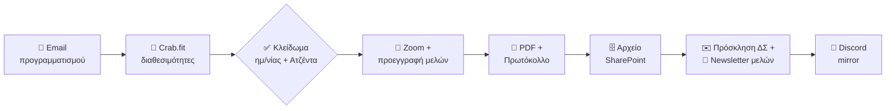
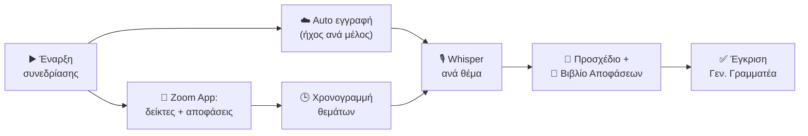
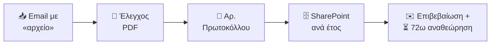
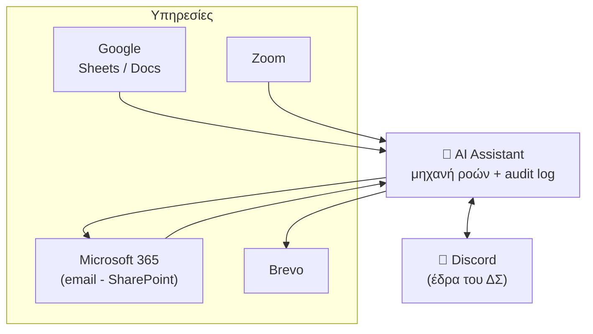

<!--
  PRESENTATION SOURCE - for Claude Design.
  Audience: Board of Directors (Διοικητικό Συμβούλιο), Amnesty International Greece.
  Language: Greek (present as-is).
  Each "---" is a slide boundary. <!-- visual: ... --> notes suggest imagery/layout.
  Brand: black #000000 / #0a0a0a - yellow #FFFF00 - flame #E63B11 - paper #f5f3ee.
  Fonts: Roboto Condensed (titles), Roboto (body). Candle = Amnesty mark.

  DIAGRAMS: the "Οι ροές εργασίας" section contains ```mermaid``` flowcharts.
  Render them as branded horizontal pipelines (black rounded nodes, yellow
  connectors, flame-red for human-decision diamonds) - or redraw in the deck's
  style. \n in node labels = line break.
-->

# AI Assistant
## Ψηφιακή Υποστήριξη Διοικητικού Συμβουλίου

**Διεθνής Αμνηστία - Ελληνικό Τμήμα**

<!-- visual: full-bleed black slide, yellow title, candle mark bottom-right -->

---

## Γιατί

Κάθε κύκλος συνεδρίασης του Δ.Σ. απαιτεί **δεκάδες χειροκίνητα βήματα**:

- Συλλογή διαθεσιμοτήτων & κλείδωμα ημερομηνίας
- Δημιουργία Zoom & εγγραφή μελών
- Σύνταξη πρόσκλησης, αρίθμηση πρωτοκόλλου, αρχειοθέτηση
- Αποστολή σε Δ.Σ. και ενημέρωση μελών
- Τήρηση πρακτικών, καταγραφή αποφάσεων

**Επαναλαμβανόμενα. Χρονοβόρα. Επιρρεπή σε λάθη.**

<!-- visual: a tangled flowchart on the left, fading to a single clean line on the right -->

---

## Η ιδέα

> Ένας **ψηφιακός βοηθός** που αναλαμβάνει τη διαδικαστική εργασία,
> ώστε το Δ.Σ. να επικεντρώνεται στην **ουσία** - όχι στη γραφειοκρατία.

Με τρεις αρχές:

1. **Ο άνθρωπος αποφασίζει** - η AI προετοιμάζει, δεν αποφασίζει.
2. **Πλήρης διαφάνεια** - κάθε ενέργεια καταγράφεται.
3. **Δεοντολογία πρώτα** - βασισμένο στην πολιτική AI της Διεθνούς Αμνηστίας.

<!-- visual: three columns / pillars under a single roof -->

---

## Τι κερδίζει το Δ.Σ.

| | |
|---|---|
| ⏱️ **Χρόνος** | Ώρες διοικητικής εργασίας ανά κύκλο, αυτοματοποιημένες |
| ✅ **Συνέπεια** | Ίδια διαδικασία, ίδια ποιότητα, κάθε φορά |
| 🔍 **Ιχνηλασιμότητα** | Πλήρες ιστορικό κάθε ενέργειας (audit log) |
| 👥 **Διαφάνεια** | Τα μέλη βλέπουν ημερήσιες διατάξεις & αποφάσεις |
| 📋 **Συμμόρφωση** | Αυτόματη αρίθμηση πρωτοκόλλου & αρχειοθέτηση κατά το Καταστατικό |
| 🎨 **Ταυτότητα** | Ενιαία, επαγγελματική εικόνα Amnesty σε κάθε επικοινωνία |

<!-- visual: 6 icon cards in a 2x3 grid, yellow accents -->

---

# Οι δυνατότητες
## Τι κάνει, βήμα-βήμα

<!-- visual: section divider, black slide -->

---

## 1 - Κύκλος Πρόσκλησης Συνεδρίασης

Το **κεντρικό** workflow - από την ιδέα μέχρι την αποστολή:

1. 📧 **Email προγραμματισμού** στο Δ.Σ. με φόρμα διαθεσιμότητας
2. 📅 **Crab.fit** - αυτόματη δημιουργία πλέγματος διαθεσιμοτήτων
3. 📋 Ανάγνωση **ημερήσιας διάταξης** από το Google Sheet
4. 🎥 Δημιουργία **Zoom** + προεγγραφή κάθε μέλους (προσωπικός σύνδεσμος)
5. 📄 Παραγωγή **PDF πρόσκλησης** με αριθμό πρωτοκόλλου
6. 🗄️ **Αρχειοθέτηση** στο SharePoint
7. ✉️ Τελική **πρόσκληση** στο Δ.Σ. + **newsletter** στα μέλη

> Δοκιμασμένο **live** - ένας πλήρης κύκλος ολοκληρώνεται σε λεπτά.

<!-- visual: horizontal 7-step pipeline with icons, yellow progress line -->

---

## 2 - Διαθεσιμότητες χωρίς τριβή

- Ο Πρόεδρος επιλέγει υποψήφιες ημερομηνίες - με **διαδραστικό ημερολόγιο** στο Discord ή μία εντολή.
- Το σύστημα δημιουργεί αυτόματα το **Crab.fit** πλέγμα.
- Τα μέλη συμπληρώνουν με ένα κλικ- ο Πρόεδρος κλειδώνει την ημερομηνία.

<!-- visual: screenshot of the Discord calendar date-picker (green selected days) next to a Crab.fit grid -->

---

## 3 - Πρακτικά & Αποφάσεις

Από την ηχογράφηση στο προσχέδιο:

1. 🎙️ Λήψη **ηχητικού** της συνεδρίασης (Zoom)
2. ✍️ **Απομαγνητοφώνηση** (τοπικά, με μοντέλο Whisper - τα δεδομένα δεν φεύγουν)
3. 🗣️ **Απόδοση ομιλητών** ανά παρέμβαση
4. 📝 **Προσχέδιο πρακτικών** + καταγραφή **αποφάσεων**, τεκμηριωμένων με άρθρα του Καταστατικού

> Ο Γεν. Γραμματέας **διορθώνει & εγκρίνει** - η AI κάνει την πρώτη γραφή.

<!-- visual: waveform → text → structured minutes document, left to right -->

---

## 4 - Αρχειοθέτηση & Πρωτόκολλο

- Αυτόματη **αρίθμηση πρωτοκόλλου** (μορφή `ΕΤΟΣ_ΝΝΝ`)
- Οργάνωση στο **SharePoint** ανά έτος, με ταξινόμηση
- Παρακολούθηση εισερχομένων: στείλε ένα PDF με «αρχείο» στο θέμα → αρχειοθετείται μόνο του
- **Παράθυρο αναθεώρησης 72 ωρών** πριν οριστικοποιηθεί

<!-- visual: an inbox arrow flowing into neat year-labeled folders -->

---

## 5 - Discord - η ψηφιακή έδρα του Δ.Σ.

Ένας χώρος όπου όλα συνδέονται:

- 🧵 **Mirror** κάθε email του Δ.Σ. σε ιδιωτικό thread
- 📆 Αυτόματα **scheduled events** για τις συνεδριάσεις
- 🔘 **Slash commands** για Πρόεδρο/Γραμματέα (`/board`, `/archive`, `/admin`)
- 🔁 **Γέφυρα email ↔ Discord** - απαντάς όπου σε βολεύει
- 📊 Κάρτες κατάστασης, ενημερώσεις, RSS

<!-- visual: Discord window mockup showing a board thread with an invitation embed -->

---

## 6 - Επικοινωνία με ταυτότητα

Κάθε email - πρόσκληση, προγραμματισμός, πρακτικά - με **ενιαία σχεδίαση Amnesty**:

- Μαύρο / κίτρινο, το κερί-σύμβολο, τυπογραφία Amnesty
- Καθαρά, επαγγελματικά, αναγνωρίσιμα
- Εργαλείο **προεπισκόπησης** για άμεσο έλεγχο πριν την αποστολή

<!-- visual: 2-3 rendered email previews fanned out (see rendered_previews/ in bundle) -->

---

## 7 - Μέσα στη συνεδρίαση (Zoom)

Ένα **πλαϊνό panel** μέσα στο Zoom για τον Πρόεδρο / Γραμματέα:

- **Δείκτες ενοτήτων** - ο τρέχων τίτλος της ημερήσιας διάταξης εμφανίζεται σε όλους
- **Καταγραφή αποφάσεων** ζωντανά - αρίθμηση `ΔΣ01-05-2026`, «έχοντας υπόψη», Έγκριση / Απόρριψη
- **Έλεγχος εγγραφής** + **χρονογραμμή** κάθε ενότητας → αυτόματος διαχωρισμός πρακτικών ανά θέμα

> Μόνιμη, ασφαλής υποδομή - σε φάση δοκιμών για τις επόμενες συνεδριάσεις.

<!-- visual: Zoom meeting with the AI Assistant sidebar panel highlighted (agenda + decision capture) -->

---

# Οι ροές εργασίας
## Πώς συνδέονται όλα

<!-- visual: section divider, black slide -->

---

## Ροή 1 - Κύκλος Πρόσκλησης Συνεδρίασης

Από τον προγραμματισμό μέχρι την αποστολή - αυτοματοποιημένα, με ανθρώπινη έγκριση στα κρίσιμα σημεία.



> Το ◇ είναι το σημείο **ανθρώπινης απόφασης** (ο Πρόεδρος κλειδώνει ημερομηνία & ατζέντα). Όλα τα υπόλοιπα τρέχουν μόνα τους.

<!-- visual: render this Mermaid as a branded horizontal pipeline - black rounded nodes, yellow connectors, the diamond in flame-red; left→right -->

---

## Ροή 2 - Συνεδρίαση → Πρακτικά

Η συνεδρίαση «καταγράφει τον εαυτό της» - η χρονογραμμή των θεμάτων συγχρονίζεται με τον ήχο για πρακτικά χωρισμένα ανά θέμα.



> Η AI κάνει την **πρώτη γραφή**- ο Γενικός Γραμματέας διορθώνει & εγκρίνει.

<!-- visual: same branded pipeline style; emphasise the two inputs (timeline + audio) merging into Whisper -->

---

## Ροή 3 - Αρχειοθέτηση με ένα email

Στείλε ένα PDF με «αρχείο» στο θέμα - αρχειοθετείται μόνο του, με πρωτόκολλο.



<!-- visual: branded horizontal pipeline; the 72h window as a small timer chip -->

---

## Η μεγάλη εικόνα

Ένας πυρήνας που ενορχηστρώνει τις υπηρεσίες - με **πλήρη καταγραφή** κάθε ενέργειας.



> **Ο άνθρωπος αποφασίζει. Η AI εκτελεί. Τα πάντα καταγράφονται.**

<!-- visual: hub-and-spoke; the core node large & black/yellow, services as satellites -->

---

## Ασφάλεια & Εμπιστοσύνη

- 🔒 **Test mode** - κάθε λειτουργία δοκιμάζεται με ασφάλεια πριν «βγει live»
- ↩️ **Rollback** - κάθε ενέργεια μπορεί να αναιρεθεί
- 📜 **Audit log** - ποιος, τι, πότε - για κάθε βήμα
- 🗝️ Τα ευαίσθητα δεδομένα μένουν **τοπικά** (απομαγνητοφώνηση χωρίς cloud)

<!-- visual: shield icon with the four guarantees as a checklist -->

---

## Δεοντολογικό Πλαίσιο

Χτισμένο πάνω στην **πολιτική AI της Διεθνούς Αμνηστίας**:

- Η AI **υποστηρίζει**, δεν αντικαθιστά την ανθρώπινη κρίση
- Διαφάνεια στο πού και πώς χρησιμοποιείται
- Σεβασμός στα προσωπικά δεδομένα μελών & Δ.Σ.

<!-- visual: a human hand and a circuit, meeting - balanced -->

---

# Πού πάμε
## Ο επόμενος ορίζοντας

<!-- visual: section divider, black slide -->

---

## Roadmap

| Σύντομα | Όραμα |
|---|---|
| **Προβολή μελών** στο Zoom (ατζέντα + αποφάσεις, μόνο ανάγνωση) | **Ζωντανή απομαγνητοφώνηση** κατά τη συνεδρίαση |
| **Αυτόματος διαχωρισμός** πρακτικών ανά θέμα | **AI προσχέδιο «έχοντας υπόψη»** από προηγούμενες αποφάσεις |
| `status.` & `docs.` σελίδες | Ανίχνευση αποφάσεων σε **πραγματικό χρόνο** |

> Η τεχνολογία **RTMS** της Zoom το κάνει εφικτό - η υποδομή είναι ήδη έτοιμη.

<!-- visual: a timeline arrow, "σήμερα" on the left, "αύριο" on the right -->

---

## Σε μία εικόνα

**Σήμερα**, το Δ.Σ. έχει έναν βοηθό που:

- Στέλνει προσκλήσεις, προγραμματίζει, αρχειοθετεί - **αυτόματα**
- Κρατά **ενιαία, διαφανή, ιχνηλάσιμη** διαδικασία
- Σέβεται τη **δεοντολογία** και τα **δεδομένα**

**Αύριο**, θα γράφει το προσχέδιο των πρακτικών ενώ μιλάτε.

<!-- visual: closing slide, black, yellow candle, single strong line -->

---

# Ευχαριστώ
## Ερωτήσεις;

**Διεθνής Αμνηστία - Ελληνικό Τμήμα - amnesty.gr**

<!-- visual: black slide, candle mark, contact line -->
